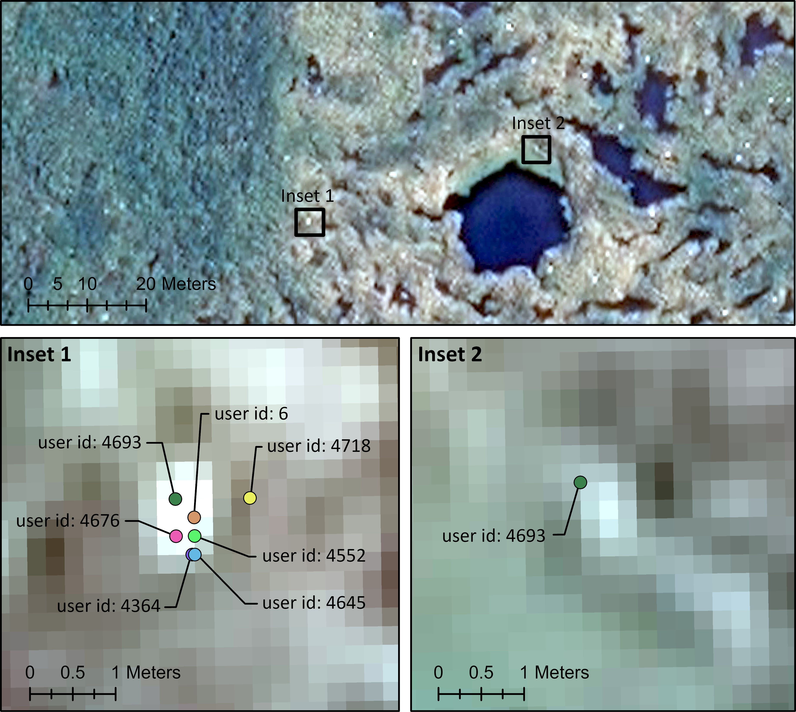

# Citizen science annotations of wandering albatrosses in satellite imagery, a dataset for training machine learning models


This repository contains python preprocessing scripts and demonstration jupyter notebooks for the dataset paper:
**Bowler et al. (2026) "Citizen science annotations of wandering albatrosses in satellite imagery, a dataset for training machine learning models" [in review].**

This data paper contains images and annotations from the *Albatrosses from space* citizen science campaign, aiming to count wandering albatrosses in high-resolution WorldView-3 satellite imagery (31 cm resolution). Details and outcomes of that study are published in the paper:
**Attard et al. (2026) "Crowdsourcing for conservation: A citizen science approach to monitoring wandering albatrosses using satellite imagery" [in prep].**


We publish this dataset of image tiles and annotations with the hope that it will improve access to training examples for machine learning model development, and for investigation into uncertainty derived from inter-observer variability. 

---

### **Table of Contents**

<!-- TOC -->
* [Introduction](#introduction)
* [Data overview](#data-overview)
* [Installation](#installation)
* [Usage](#usage)
* [Reusing or adapting the scripts](#reusing)
* [Data access](#data-access)
* [Acknowledgements](#acknowledgements)
* [License](#license)
* [Funding](#funding)

<!-- TOC -->

---

## Introduction <a name="introduction"></a>


We conducted the first citizen science campaign to count wandering albatrosses *Diomedea exulans* during the breeding season using Vantor's (previously Maxar Technologies) GeoHive platform and very high-resolution (31 cm) satellite imagery, collected over 24 locations in South Georgia between 2015 to 2022. Citizen scientists labelled  albatrosses in 150 m × 150 m image tiles, with each viewed by seven unique users. In total, citizen scientists classified 10,833 tiles, covering 154 km² of breeding habitat. 

This repository includes python scripts and notebooks which were used to preprocess the citizen science annotations and georeferenced image tiles ready for publication. We note these georeferenced images tiles are not included due to licensing restrictions, however we hope these scripts can be useful for others who wish to publish their own data in a similar way. 

The repository also includes demonstration notebooks showing how final images and annotations can be loaded ready for use with common machine learning models. The final image/annotation dataset can be freely download from the Polar Data Centre (DOI: ). To run the demonstration notebooks these files should be placed in the `data` folder of this repository once installed (see details below). 


## Data overview <a name="data-overview"></a>

The data consists of .png image tiles and corresponding x,y pixel annotations in both .csv and .json format. The two annotation .csv/.json files include:

**Citizen science image annotations**: These include all annotations made by each citizen scientist. Citizen scientists can be differentiated by their unique "user id". An example is shown on the image below. 

**Expert annotations** A subset of tiles were annotated by seven expert obervers (with previous experience annotating wildlife in very high resolution satellite imagery). These annotations are provided in different files and can be used for comparison and validation. 





## Installation <a name="installation"></a>
To set up the project:

#### 1. Clone the repository:
```shell
git clone https://github.com/elliebowler/wandering-albatross-worldview-data-paper.git
```

#### 2. Set up a virtual environment:
This command reads the environment.yaml file and installs all dependencies
```shell
conda env create -f environment.yaml
```

#### 3. Activate the virtual environment:
```shell
conda activate annotation-env
```

## Usage <a name="usage"></a>


#### 1. Download data:
For the full dataset please download from the PDC and place in the `data` folder. The `data-loading-example.ipynb` script demonstrates how this data can be loaded and plotted.

> **Note:** The files in the `scripts` folder were used to convert georeferenced .tiff and .shp files to the format published, however these files are not supplied due to licensing restrictions.  When you
> run `python scripts/process_*.py` you must supply your own filenames or
> place copies of your Shapefiles in `data/` and link to those. We have set generic basenames 
> as defaults placeholders (e.g. `crowd_annotations.shp`, `image_grid.shp`,
> `expert_points.shp`).  Inspect the `--help` output for each script to see
> what arguments are expected and modify the paths accordingly.

#### 2. Launch Jupyter Notebook:
```shell
jupyter notebook
```

#### 3. Run the analysis:

Open `data-loading-example.ipynb`.
Run the cells in the jupyter notebook sequentially to test loading and plotting the data and annotations.

## Reusing or Adapting the Scripts <a name="reusing"></a>

The `scripts/` directory contains python scripts used during preprocessing of geotiffs and shapefiles into the published format.  No georeferenced input files are
included in this repository; the Python code is intended as **illustrative
boilerplate** that can be adapted to suit other projects. 


| Script | Purpose |
|--------|---------|
| `tiff_to_png.py` | Read a folder of GeoTIFF tiles, stack the first three bands as RGB, and write standard image files (PNG or JPG). Useful for releasing non‑georeferenced versions of imagery. |
| `process_citizen_science_data.py` | Clean the full crowdsourced dataset, apply quality filters (e.g. exactly seven reviewers per tile), and generate COCO‑style JSON plus optional CSV outputs. Includes a helper `save_tif_as_png` function for exporting underlying GeoTIFFs. |
| `process_expert_data.py` | Similar to the citizen‑science script but tailored to the expert‑reviewed subset. Demonstrates filtering by catalogue and site, and serialising annotations with metadata. |
| `process_expert_points_to_pixel_coords.py` | Convert a point shapefile of expert annotations into pixel coordinates by locating the nearest pixel in each GeoTIFF. Includes optional nest‑boundary checks. |
| `process_raw_points_to_pixel_coords.py` | Generic template for converting any point shapefile and grid metadata into a CSV of pixel coordinates. |

By design the code does not assume any particular directory layout; input
paths are passed as command‑line arguments.  When adapting the scripts for your
own work please retain a citation to the accompanying data paper:

Ellen Bowler, Marie R. G. Attard, Richard A. Phillips and Peter T. Fretwell
(2026) "Citizen science annotations of wandering albatrosses in satellite
imagery, a dataset for training machine learning models". [In Review]


## Data access <a name="data-access"></a>

Non-georeferenced image tiles and .csv and .json formatted labels from the crowdsourcing campaign can be downloaded from the Polar Data Centre (doi: [Insert doi]). 

## Acknowledgements <a name="acknowledgements"></a>
Thank you to Sally Poncet for her contributions throughout the project and for provision of ground survey data and breeding site boundaries. We thank all fieldworkers for their extensive efforts to complete ground counts of wandering albatrosses, especially Ken Passfield (over 15 seasons) and Dion Poncet (two decadal censuses). We are grateful to Connor Bamford, Tara Cunningham, Hugo Guímaro, Penny Clarke and Holly Houliston from BAS for their contributions to the private campaign, and to all participants in the citizen science campaign. We thank the Vantor GeoHIVE team—Denise Davis, Julie Earls, Dimitrios Roussos, Paulo Godinho and Sebastian Potter—for their assistance, and Mari Whitelaw (Polar Data Centre) for her data repository expertise. Thanks to Venessa Amaral-Rogers (RSPB), Athena Dinar (BAS) and Atikata Miyabe and Yasuko Suziki (Birdlife International Tokyo) for campaign promotion. Finally, we appreciate the ongoing feedback from our project partners, RSPB and the Government of South Georgia and the South Sandwich Islands. 

## License <a name="license"></a>

The satellite images and annotations are subject to the Vantor Satellite Imagery License Agreement:
https://www.maxar.com/legal/internal-use-license

## Funding <a name="funding"></a>

This work was supported by Darwin Plus (DPLUS132 and DPLUS187). For more details, visit the Darwin Initiative project website: https://www.darwininitiative.org.uk/project/DPLUS132

